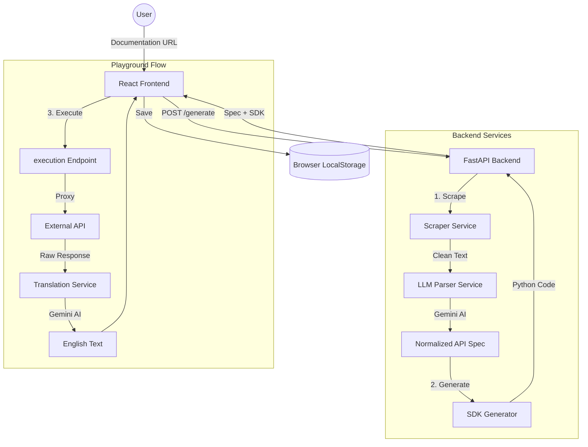

# Doc2SDK: Full Project Documentation

Doc2SDK is an AI-powered developer tool designed to bridge the gap between API documentation and production-ready code. It automates the process of extracting API specifications, translating them into English, generating type-safe Python SDKs, and providing an interactive playground for instant testing.

---

## 🏗️ Architecture Overview

Doc2SDK follows a modern stateless architecture, leveraging AI for intelligence while maintaining local storage in the browser for a seamless developer experience.



---

## 🚀 Core Features

### 1. Multi-Source Intelligence
- **Scraping**: Automatically fetches and extracts relevant API text from public URLs or raw OpenAPI/Swagger JSON.
- **AI Parsing**: Uses Google Gemini to detect endpoints, methods, parameters, and authentication logic.
- **English Enforcement**: Automatically translates foreign-language documentation and live API responses into English.

### 2. Standardized Code Generation
- **Type-Safe SDKs**: Generates production-ready Python code with dataclasses and proper error handling.
- **Normalized Specs**: Converts complex documentation into a clean, standard JSON format.

### 3. Interactive Playground
- **Dynamic Testing**: Instantly test discovered endpoints without writing code.
- **AI Translation Layer**: Live API responses (including Latin placeholders or foreign data) are translated into English on-the-fly.

---

## 🛠️ Technology Stack

| Layer | Technologies |
| :--- | :--- |
| **Frontend** | React 19, Vite, TypeScript, Framer Motion, Lucide Icons |
| **Backend** | FastAPI (Python 3.10+), Httpx, SQLAlchemy, SQLite |
| **AI Core** | Google Gemini (generativeai), Custom Prompt Engineering |
| **DevOps** | Docker, Docker Compose |

---

## 📂 Project Structure

```text
├── backend/
│   ├── app/
│   │   ├── core/           # Security and Config
│   │   ├── generators/     # SDK Code Templates
│   │   ├── parsers/        # Spec Normalization
│   │   ├── routers/        # API Endpoints (Unified, SDKs, etc.)
│   │   ├── services/       # Scraper, LLM, Translator
│   │   ├── schemas.py      # Pydantic Models
│   │   └── main.py         # Entry Point
│   └── requirements.txt
├── frontend/
│   ├── src/
│   │   ├── components/     # Reusable UI (Layout, Sidebar)
│   │   ├── pages/          # Workspace, Dashboard, Projects
│   │   └── api.ts          # Axios Configuration
│   └── package.json
└── docker-compose.yml
```

---

## 🏁 Getting Started

### Prerequisites
- Python 3.10+
- Node.js 18+
- Gemini API Key (get it from [Google AI Studio](https://aistudio.google.com/))

### Installation

1. **Clone & Configure**:
   ```bash
   # Create backend/.env
   GEMINI_API_KEY=your_key_here
   DATABASE_URL=sqlite:///./antigravity.db
   ```

2. **Backend Setup**:
   ```bash
   cd backend
   python -m venv venv
   source venv/bin/activate  # Windows: venv\Scripts\activate
   pip install -r requirements.txt
   uvicorn app.main:app --reload
   ```

3. **Frontend Setup**:
   ```bash
   cd frontend
   npm install
   npm run dev
   ```

---

## 📡 API Reference

### `POST /api/v1/generate`
Generates an SDK and Spec from a documentation URL.
- **Request**: `{ "source_url": "string" }`
- **Response**: Full `APIProject` object including `sdk_code` and `spec`.

### `POST /api/v1/playground/execute`
Proxies a request to an external API and translates the response.
- **Request**: Path params, method, headers, and JSON body.
- **Response**: Translated JSON response from the target API.

---

## 🛡️ Best Practices
- **Rate Limiting**: Be aware of Gemini API limits when generating multiple large projects.
- **Security**: Never commit your `.env` file or store production keys in the code.
- **Statelessness**: The project intentionally uses LocalStorage for demo purposes; for multi-user production, integrate a centralized database.

---

## 📄 License
Distributed under the MIT License. See `LICENSE` for more information.
